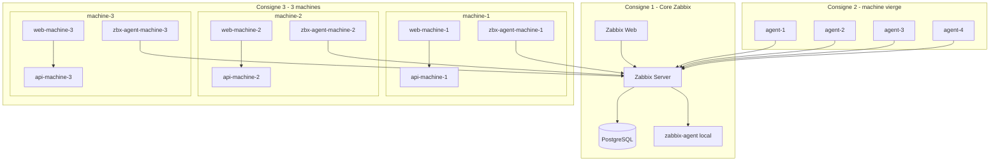

# Zabbix Supervision Lab

Plateforme de supervision Docker conforme aux 3 consignes:

1. C1: Zabbix Server + Web + Base de donnees
2. C2: Agent sur machine vierge avec auto-discovery/template (noms lisibles `agent-1..4`)
3. C3: 3 machines logiques, chacune en 3 conteneurs (`web + api + agent`)

## Architecture



## Captures d'ecran

Le depot ne contient pas de captures PNG versionnees par defaut.
Le visuel ci-dessous est present dans le repo et s'affiche correctement sur GitHub:


Si tu veux ajouter de vraies captures d'ecran plus tard, place simplement dans `docs/images/`:

- `zabbix-hosts.png`
- `docker-containers.png`

## Prerequis

```bash
cd /root/Zabbix
make init
```

Prerequis machine:

- Docker
- Docker Compose
- `make`

## Configuration `.env` (important)

Le fichier `.env` est le point central de personnalisation.
Tu dois l'adapter a ta machine avant lancement:

- ports (`ZABBIX_WEB_PORT`, `APP_MACHINE*_WEB_PORT`) si deja occupes
- mot de passe base (`POSTGRES_PASSWORD`)
- mode de bootstrap (`ENABLE_AUTOSCALE_STACK`)

Commandes utiles:

```bash
make env-show   # affiche les variables principales
make env-edit   # ouvre .env pour modification
```

## Lancement rapide

Pour lancer toute la stack:

```bash
cd /root/Zabbix
make init
make all
```

Acces principaux une fois la stack demarree:

- Zabbix Web: `http://localhost:8080`
- Machine 1: `http://localhost:8081`
- Machine 2: `http://localhost:8082`
- Machine 3: `http://localhost:8083`

## Commandes `make`

Le `Makefile` centralise les commandes utiles du projet:

```bash
make help          # affiche toutes les cibles
make init          # cree .env si absent
make env-show      # affiche les ports et variables principales
make env-edit      # edite .env
make run-c1        # lance uniquement le core Zabbix
make run-c2        # lance C1 + les agents agent-1..4
make run-c3        # lance C1 + les 3 machines web/api/agent
make all           # lance C1 + C2 + C3 ensemble
make bootstrap     # lance C2 ou C3 selon ENABLE_AUTOSCALE_STACK
make status        # affiche l'etat des conteneurs
make hosts         # liste les hotes Zabbix via l'API
make reset         # arret propre des stacks
make destroy       # suppression des stacks
```

## Comment lancer le projet

- C1 seulement:
```bash
make run-c1
```

- C2 (C1 + agents `agent-1..4`):
```bash
make run-c2
```

- C3 (C1 + 3 machines web/api/agent):
```bash
make run-c3
```

- Tout lancer en une fois:
```bash
make all
```

- Reset propre:
```bash
make reset
```

## Nettoyage des hotes parasites

```bash
make cleanup
make cleanup-c1
make cleanup-c2
make cleanup-c3
make cleanup-all
```

## Script principal

`make bootstrap` choisit automatiquement:

- `make run-c2` si `ENABLE_AUTOSCALE_STACK=true`
- `make run-c3` sinon

## Verification

```bash
make status
make hosts
```

## Documentation detaillee

- [docs/RUNBOOK.md](docs/RUNBOOK.md)
- [docs/COMPONENTS.md](docs/COMPONENTS.md)
- [docs/ARCHITECTURE.md](docs/ARCHITECTURE.md)
