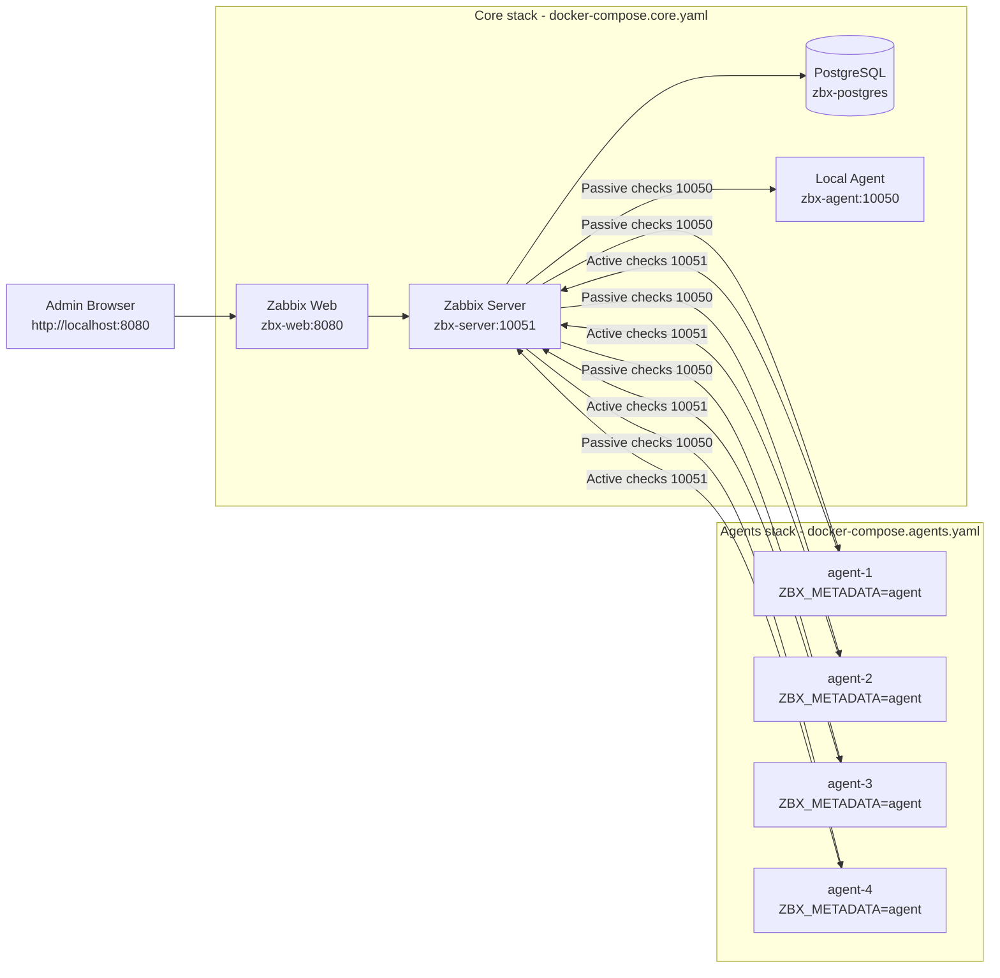

# Zabbix Auto-Registration Stack

Stack Docker complète pour déployer Zabbix, connecter des agents, et valider un auto-enregistrement fiable basé sur la metadata (`host metadata`).

## Objectifs

- Déployer rapidement un environnement Zabbix opérationnel.
- Ajouter des agents Docker autonomes (`agent-1..4`).
- Auto-créer les hôtes côté Zabbix via `Autoregistration actions`.
- Éviter les erreurs courantes observées en lab:
  - `host [agent-x] not found`
  - interfaces cassées après changement d'IP Docker
  - metadata non transmise

## Architecture



## Structure du projet

- `docker-compose.core.yaml`: Postgres + Zabbix Server + Zabbix Web + agent local (`Zabbix server`).
- `docker-compose.agents.yaml`: agents `agent-1..4` sur le réseau `zabbix_default`.
- `.env.example`: variables de base de la stack.
- `.gitignore`: exclusion `.env` + `data/`.

## Prérequis

- Docker Engine + Docker Compose plugin.
- Ports libres sur la machine hôte:
  - `8080` (UI Zabbix)
  - `10051` (trapper/server)
  - `10050` (agent local exposé)

## Déploiement

### 1) Préparer l'environnement

```bash
cp .env.example .env
```

### 2) Démarrer le coeur Zabbix

```bash
docker compose -f docker-compose.core.yaml up -d
```

### 3) Démarrer les agents

```bash
docker compose -f docker-compose.agents.yaml up -d
```

## Configuration Zabbix (obligatoire)

Menu: `Alerts > Actions > Autoregistration actions`

Créer (ou éditer) l'action `auto-enrollement` avec:

- Condition:
  - `Host metadata contains agent`
- Operations:
  - `Add host`
  - `Add to host groups: Linux servers`
  - `Link templates: Linux by Zabbix agent`
  - `Enable host`

## Paramètres agents importants

Dans `docker-compose.agents.yaml`:

- `ZBX_HOSTNAME`: doit être unique (`agent-1`, `agent-2`, ...).
- `ZBX_METADATA`: **clé correcte** utilisée par l'image `zabbix/zabbix-agent2`.
- `ZBX_SERVER_HOST` / `ZBX_SERVER_ACTIVE`: `zabbix-server`.

## Vérifications opérationnelles

### Vérifier les conteneurs

```bash
docker ps --format 'table {{.Names}}\t{{.Status}}\t{{.Ports}}'
```

### Vérifier les logs serveur

```bash
docker logs --tail 200 zbx-server
```

Signes de bon fonctionnement:
- disparition de `host [agent-x] not found`
- apparition des hosts `agent-1..4` dans l'UI

### Vérifier les logs agents

```bash
docker logs --tail 120 zbx-agent-1
```

Signe attendu:
- `active checks on server are active again`

## Gestion des interfaces (important)

Dans Zabbix, pour les hosts auto-créés, privilégier:

- `Connect to: DNS`
- DNS = nom de conteneur (`zbx-agent-1`, etc.)
- Port = `10050`

Pourquoi: les IP Docker changent après `down/up`, le DNS de service reste stable.

## Dépannage rapide

### Problème: `host [agent-x] not found`

Causes probables:
- action d'auto-registration absente/désactivée
- condition metadata ne matche pas
- agent n'envoie pas la bonne metadata

Contrôles:
- action `Enabled`
- condition `Host metadata contains agent`
- compose agents: `ZBX_METADATA: agent`

### Problème: agent rouge / `Connection refused`

Cause probable:
- interface Zabbix sur mauvaise IP après redémarrage Docker

Correction:
- passer l'interface host en mode DNS
- renseigner le nom de service Docker

### Problème: rien n'apparait après suppression manuelle des hosts

Procédure:
1. Vérifier l'action d'auto-registration.
2. Redémarrer les agents:
   ```bash
   docker compose -f docker-compose.agents.yaml up -d --force-recreate
   ```
3. Surveiller les logs `zbx-server` pendant 1 à 2 cycles.

## Commandes utiles

### Redémarrer seulement les agents

```bash
docker compose -f docker-compose.agents.yaml up -d --force-recreate
```

### Stopper les agents

```bash
docker compose -f docker-compose.agents.yaml down
```

### Stopper toute la stack

```bash
docker compose -f docker-compose.agents.yaml down
docker compose -f docker-compose.core.yaml down
```

## Sécurité / bonnes pratiques

- Ne pas commiter `.env` ni `data/`.
- Changer les mots de passe par défaut avant usage non-lab.
- Restreindre les ports exposés en environnement partagé.
- Versionner les actions Zabbix via runbook interne (ou API) pour reproductibilité.

## Licence

Usage interne lab / POC.
