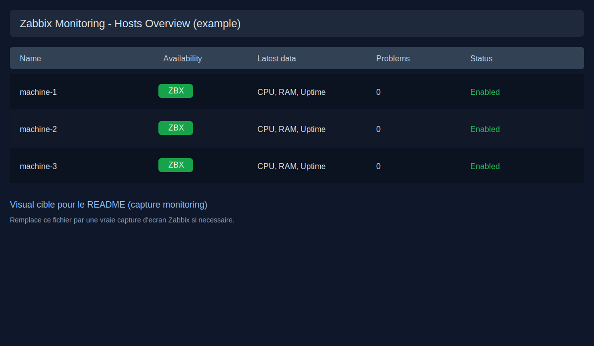
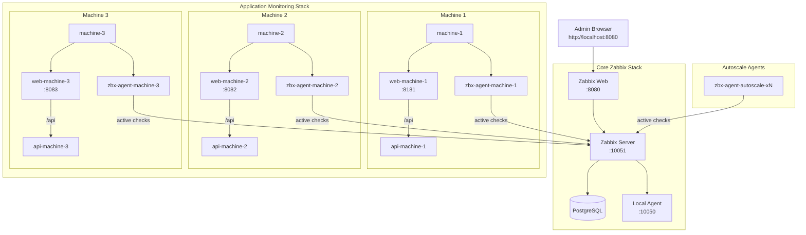

# Zabbix Supervision Lab

Plateforme de supervision Docker, clonable et reconfigurable via un seul fichier `.env`.

## Ce que fournit le projet

- stack coeur Zabbix: PostgreSQL + Zabbix Server + Web + agent local
- stack agents autoscale (auto-registration)
- stack applicative 3 machines logiques (`web + api + agent`) pour la supervision applicative
- scripts d'exploitation: lancement complet, configuration auto-registration, destruction propre

## Capture monitoring



## Architecture



Ports are configurable via `.env` (`ZABBIX_WEB_PORT`, `APP_MACHINE*_WEB_PORT`, etc.).

## Arborescence

```text
/root/Zabbix
├── .env.example
├── Zabbix/
│   └── docker-compose.yaml
├── Agent-Zabbix/
│   └── docker-compose.yaml
├── App/microservice_python/
│   ├── monitoring-compose.yml
│   ├── docker-compose.yml
│   ├── microservice_user/
│   ├── microservice_product/
│   ├── microservice_order/
│   └── nginx/
├── scripts/
│   ├── bootstrap.sh
│   ├── configure_autoregistration.sh
│   └── destroy.sh
└── docs/
    ├── ARCHITECTURE.md
    ├── COMPONENTS.md
    ├── RUNBOOK.md
    └── images/
```

## Configuration centralisee (`.env`)

Ce projet est concu pour eviter les valeurs hardcodees (ports, metadata, secrets, etc.).

1. Creer le fichier local:
```bash
cd /root/Zabbix
cp .env.example .env
```
2. Modifier les variables selon ta machine (ports deja utilises, mot de passe DB, etc.).

Variables principales:
- `POSTGRES_PASSWORD`
- `ZABBIX_WEB_PORT`
- `ZABBIX_SERVER_PORT`
- `ZABBIX_AGENT_PORT`
- `APP_MACHINE1_WEB_PORT`, `APP_MACHINE2_WEB_PORT`, `APP_MACHINE3_WEB_PORT`
- `ENABLE_AUTOSCALE_STACK` (`false` par defaut)

## Lancement complet

```bash
cd /root/Zabbix
./scripts/bootstrap.sh
```

Par defaut, le bootstrap lance uniquement:
- core Zabbix
- stack applicative `machine-1/2/3`

Si tu veux aussi les anciens agents autoscale:
1. mettre `ENABLE_AUTOSCALE_STACK=true` dans `.env`
2. relancer `./scripts/bootstrap.sh`

## Destruction propre

```bash
cd /root/Zabbix
./scripts/destroy.sh
```

Options:
- reset data (volumes): `./scripts/destroy.sh --purge-data`
- reset data + images locales: `./scripts/destroy.sh --purge-data --purge-images`

## Rebuild complet

```bash
cd /root/Zabbix
./scripts/destroy.sh --purge-data --purge-images
./scripts/bootstrap.sh
```

## Documentation detaillee

- architecture reseau: [docs/ARCHITECTURE.md](docs/ARCHITECTURE.md)
- description de tous les fichiers: [docs/COMPONENTS.md](docs/COMPONENTS.md)
- procedures d'exploitation: [docs/RUNBOOK.md](docs/RUNBOOK.md)
