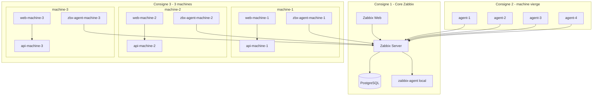

# Zabbix Supervision Lab

Plateforme de supervision Docker conforme aux 3 consignes:

1. C1: Zabbix Server + Web + Base de donnees
2. C2: Agent sur machine vierge avec auto-discovery/template (noms lisibles `agent-1..4`)
3. C3: 3 machines logiques, chacune en 3 conteneurs (`web + api + agent`)

## Architecture



## Prerequis

```bash
cd /root/Zabbix
cp .env.example .env
```

## Scenarios d'execution

- C1 seulement:
```bash
./scripts/run_consigne_1_core.sh
```

- C2 (C1 + agents `agent-1..4`):
```bash
./scripts/run_consigne_2_machine_vierge.sh
```

- C3 (C1 + 3 machines web/api/agent):
```bash
./scripts/run_consigne_3_trois_machines.sh
```

- Reset propre:
```bash
./scripts/reset_lab.sh
```

## Nettoyage des hotes parasites

```bash
# Apercu
./scripts/cleanup_hosts.sh --dry-run

# Suppression
./scripts/cleanup_hosts.sh --apply
```

## Script principal

`./scripts/bootstrap.sh` choisit automatiquement:
- `run_consigne_2_machine_vierge.sh` si `ENABLE_AUTOSCALE_STACK=true`
- sinon `run_consigne_3_trois_machines.sh`

## Documentation detaillee

- [docs/RUNBOOK.md](docs/RUNBOOK.md)
- [docs/COMPONENTS.md](docs/COMPONENTS.md)
- [docs/ARCHITECTURE.md](docs/ARCHITECTURE.md)
