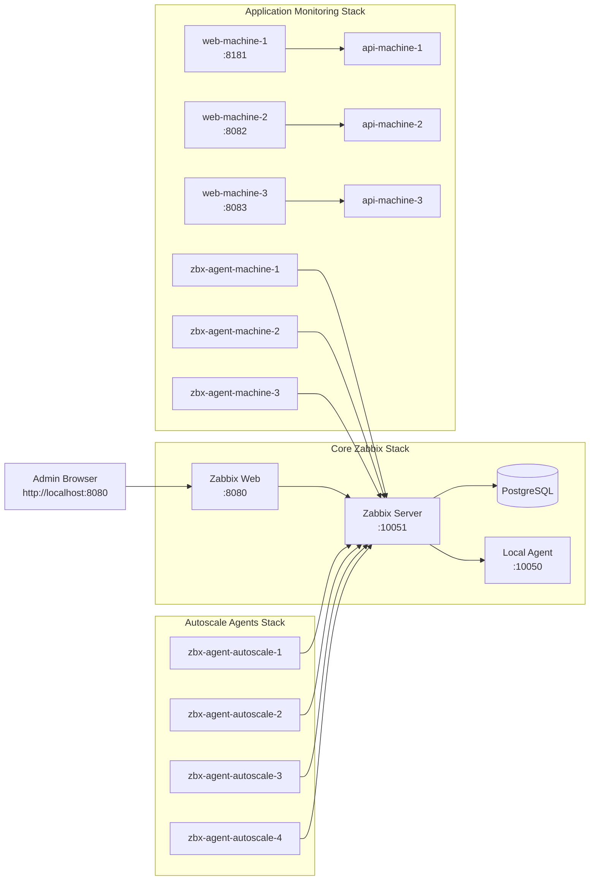

# Zabbix Supervision Lab

Plateforme de supervision complete et reproductible basee sur Zabbix, structuree pour etre recreee a la demande depuis GitHub.

## Objectif

Ce projet fournit un environnement prêt pour:
- supervision infrastructure (Zabbix Server, agents Linux)
- supervision applicative (3 machines logiques web + API REST Python)
- auto-registration des hotes via metadata
- deploiement et destruction automatises

## Architecture du projet

```text
/root/Zabbix
├── Zabbix/                # stack coeur (DB + server + web + agent local)
├── Agent-Zabbix/          # stack agents autoscale
├── App/microservice_python/ # stack applicative 3 machines + agents
├── docs/                  # documentation architecture
└── scripts/               # bootstrap, autoreg, destroy
```

## Schema d'architecture



## Composants

- `Zabbix/docker-compose.yaml`
  - PostgreSQL
  - Zabbix Server
  - Zabbix Web
  - Agent local
- `Agent-Zabbix/docker-compose.yaml`
  - Agent autoscale (scalable via `--scale`)
- `App/microservice_python/monitoring-compose.yml`
  - 3 APIs Flask
  - 3 frontaux Nginx
  - 3 agents Zabbix dedies

## Prerequis

- Docker Engine + Docker Compose plugin
- Ports libres: `8080`, `10050`, `10051`, `8181`, `8082`, `8083`

## Deploiement rapide

```bash
cd /root/Zabbix
./scripts/bootstrap.sh
```

Ce script:
1. lance le core Zabbix
2. configure les actions d'auto-registration via API
3. lance les agents autoscale
4. lance la stack applicative 3 machines

## Verification

- UI Zabbix: `http://localhost:8080` (`Admin` / `zabbix`)
- Endpoints web:
  - `http://localhost:8181`
  - `http://localhost:8082`
  - `http://localhost:8083`
- Endpoints API:
  - `http://localhost:8181/api/user`
  - `http://localhost:8082/api/product`
  - `http://localhost:8083/api/order`

## Arret / destruction propre

Arret et suppression des stacks:
```bash
cd /root/Zabbix
./scripts/destroy.sh
```

Arret + suppression des volumes (reset base Zabbix):
```bash
./scripts/destroy.sh --purge-data
```

Arret + suppression des volumes + images locales:
```bash
./scripts/destroy.sh --purge-data --purge-images
```

## Rebuild complet

```bash
cd /root/Zabbix
./scripts/destroy.sh --purge-data --purge-images
./scripts/bootstrap.sh
```

## Documentation detaillee

- Architecture reseau: [docs/ARCHITECTURE.md](docs/ARCHITECTURE.md)
- Explications par dossier: README present dans chaque repertoire du projet
- Scripts: [scripts/README.md](scripts/README.md)
