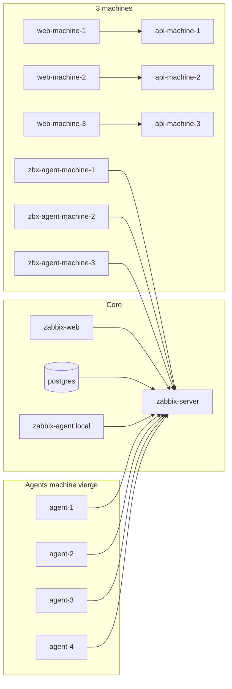

# ARCHITECTURE

## Reseaux

- `zabbix_default`: coeur Zabbix + agents
- `lab`: web/api pour C3

## Vue logique

```mermaid
flowchart LR
  ZS[zabbix-server]

  subgraph C1[Core]
    ZW[zabbix-web] --> ZS
    PG[(postgres)] --> ZS
    ZA[zabbix-agent local] --> ZS
  end

  subgraph C2[Agents machine vierge]
    A1[agent-1] --> ZS
    A2[agent-2] --> ZS
    A3[agent-3] --> ZS
    A4[agent-4] --> ZS
  end

  subgraph C3[3 machines]
    W1[web-machine-1] --> API1[api-machine-1]
    AG1[zbx-agent-machine-1] --> ZS

    W2[web-machine-2] --> API2[api-machine-2]
    AG2[zbx-agent-machine-2] --> ZS

    W3[web-machine-3] --> API3[api-machine-3]
    AG3[zbx-agent-machine-3] --> ZS
  end
```
